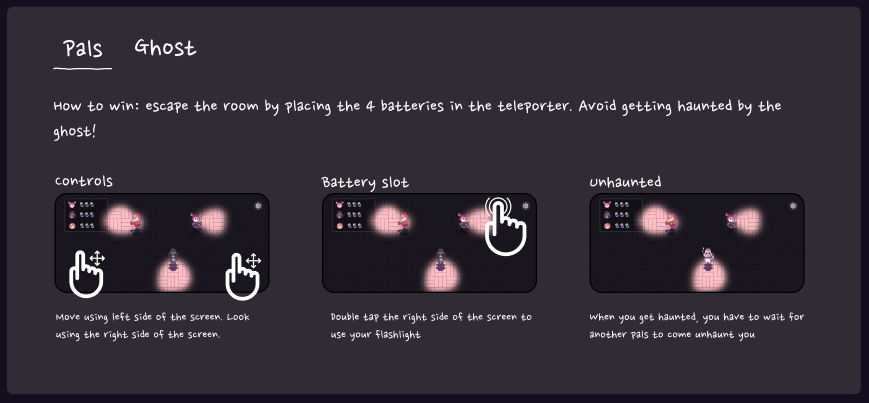
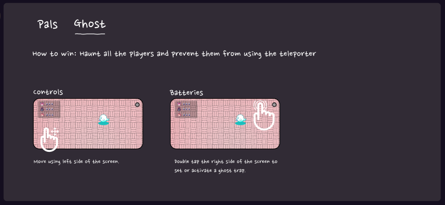

# Ghosted by Star Soup Games
Play as either the pals or the ghost in this 3v1 multiplayer game.

In an abandoned manor, a group of friends only have themselves and some flashlights to find a way out. They must band together to find the exit and escape, before the ghost haunting the house seals them in for all eternity.

## Download
[Download for Android (APK)](Ghosted.Release.Android.zip)  
[Download for iPhone (Testflight)](https://testflight.apple.com/join/NAUY9ytX)  

[Download for MacOS](Ghosted.Release.Mac.zip)  
[Download for Windows (x64)](Ghosted.Release.Windows.x64.zip)  

## Quick Start
  
  
### Controls
WASD / left half of the screen to move.  
Arrow keys / right half of the screen to look.  
Space / double tap to do action.  
ESC to go back to the start screen.  

## Other Links

[2021 GDIAC Showcase](https://gdiac.cs.cornell.edu/showcase/gallery/ghosted/)  

## Contributors
Akane Edwards, Benjamin Shen, Catie Rencricca, Konstantin Kirovski, Michael Chang, SoYee Park, Will Gao, *Aidan Cuite*, *Jacob Nannapanenni*

[Github](https://github.coecis.cornell.edu/starsoupgames/ghosted/releases/) (Cornell students only)
